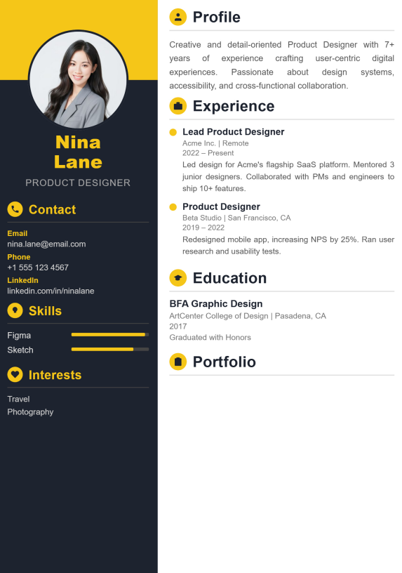
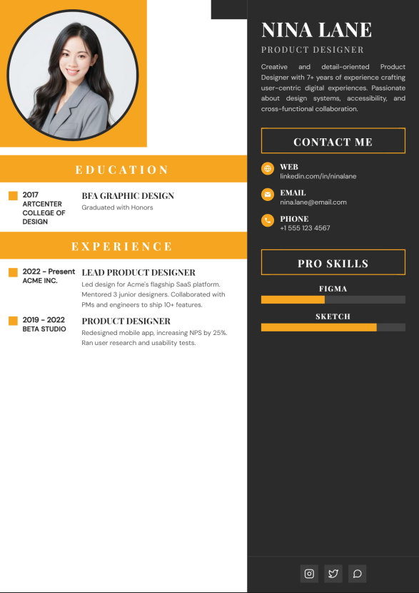

# 📄 CV Maker — Build a CV Worth Remembering

A premium, modern, and privacy-focused CV builder that lets you craft stunning, print-ready resumes in real-time. No sign-ups, no accounts, and no data tracking.

---

## ✨ Features

- **🌐 100% Client-Side & Private**: Your data never leaves your browser. No sign-up, no login, and no database tracking.
- **⚡ Real-Time Live Preview**: Watch your CV adapt instantly as you fill in your personal details, work experience, education, skills, and projects.
- **🎨 10 Curated Premium Templates**: Professionally designed layout styles ranging from minimalist to modern and executive-tier aesthetics.
- **🖨️ A4 Print-Ready Export**: One-click high-quality PDF compilation using local canvas rendering, optimized to print perfectly on standard A4 paper size.
- **✍️ Distinct Typography**: Switch between Google Fonts and pre-loaded local typography tailored for professional readability.
- **🛠️ Interactive Section Builder**: Customize profile photo, contact details, social links, work experience, projects, skills, education, and languages with ease.

---

## 🚀 Tech Stack

- **Structure**: Semantic HTML5
- **Styling**: Vanilla CSS (Tailored variables, grid layouts, dark mode splash screen, grain effects)
- **Logic**: Pure Modern JavaScript (ES6+)
- **Libraries**: [html2pdf.js](https://github.com/eKoopmans/html2pdf.js) (packaged locally in `lib/`) for client-side PDF generation

---

## 📁 Project Structure

```text
cv-maker/
├── assets/
│   ├── fonts/         # Custom local branding typography
│   └── images/        # Template preview thumbnails and site graphics
│       ├── icon.png   # Website favicon (Add your own here!)
│       └── logo.png   # CV Maker branding assets
├── css/
│   ├── form.css       # Builder sidebar and control inputs styling
│   ├── style.css      # Core landing page styling
│   └── templates.css  # Layout rules for CV templates
├── js/
│   ├── builder.js     # State management, preview builder, and form logic
│   ├── download.js    # PDF export configuration and handling
│   ├── preview.js     # Real-time preview rendering bridge
│   └── script.js      # General landing page logic & animations
├── templates/         # Individual HTML template markup files (cv001 to cv010)
├── builder.html       # Interactive builder workspace
├── index.html         # Slick homepage & landing interface
└── template.html      # Template selection catalog
```

---

## ⚡ How to Run Locally

Since **CV Maker** is a serverless, static web application, you can run it without any complex installation steps:

### Option 1: Direct Run (Easiest)
1. Clone or download this repository.
2. Locate `index.html` in the root folder.
3. Double-click to open it directly in any modern web browser.

### Option 2: Local Server (Recommended for developers)
Using a local server prevents CORS issues and ensures smooth iframe rendering.
Run one of the following commands in the project directory:

```bash
# Using Node.js (npx)
npx serve .

# Using Python 3
python -m http.server 8000

# Or use the "Live Server" extension in VS Code
```
Then visit `http://localhost:8000` (or the address printed by your server) in your browser.

---

## 🖼️ Gallery & Templates

Below is a preview of the high-quality layout templates included:

| Modern & Clean | Bold & Creative | Elegant & Professional |
|:---:|:---:|:---:|
|  |  |  |
| **cv001** | **cv002** | **cv003** |

*(You can preview all 10 designs in the template catalog inside the app).*

---

## 🎨 Customizing the Website Icon

To apply your own branding icon/logo (favicon) to the website:
1. Prepare a square PNG image (ideally **512×512** or **192×192** pixels for sharp visibility).
2. Save it as `icon.png` inside the `assets/images/` directory.
3. The icon is already fully referenced across the site and will show up in browser tabs and search engine results automatically!

---

## 👤 Credits

Created and maintained with precision by **KAViNDA**.
